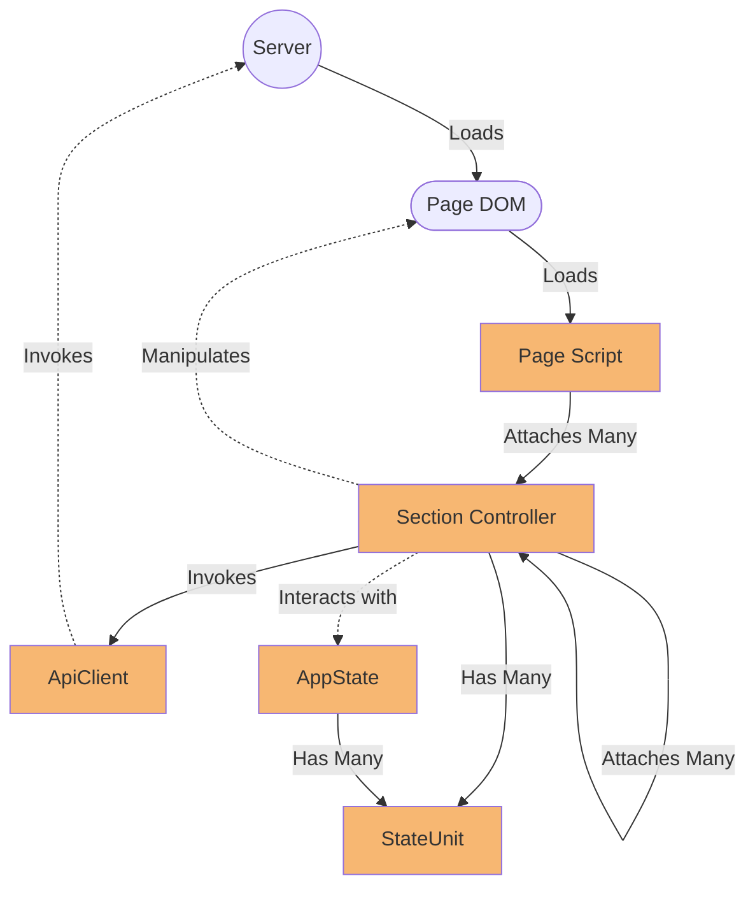

A simple app to explore as much of current browser JavaScript as possible.

The idea is to attempt to create a working application without third party libraries or transpiling, just use whatever the browser has to offer.

## Basic rules

* No third party libraries, not even for basic stuff, just ingenuity and the standard libraries available in the browser space (and lots of StackOverflow/MSDN browsing).
* No transpiling, if we need to create an element, we use the DOM api, if we need to load a module, we use the current web modules mechanism.
* This app won't even have a package.json file.

## On styling

Styling is not in the scope of this experiment, so, we just use bootstrap and continue with our day.

## The App

In order to include as many JavaScript features as possible, I decided to emulate a well known domain, a file system, everybody knows the basic rules of it, so, no need to explain what's expected for it to do.

## On Backend

This experiment doesn't have an actual backend, just a fake API script for the sake of having a "backend" to call.

## What has been done so far

After some trial and error, I've come with this "architecture" for the app.

