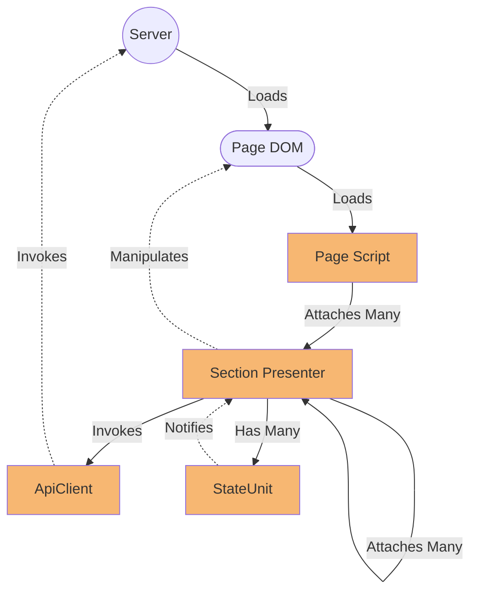

A simple app to explore as much of current browser JavaScript as possible.

The idea is to attempt to create a working application without third party libraries or transpiling, just use whatever the browser has to offer.

## Basic rules

* No third party libraries, not even for basic stuff, just ingenuity and the standard libraries available in the browser space (and lots of StackOverflow/MSDN browsing).
* No transpiling, if we need to create an element, we use the DOM api, if we need to load a module, we use the current web modules mechanism.
* This app won't even have a package.json file.

## On styling

Styling is not in the scope of this experiment, so, we just use bootstrap and continue with our day.

## The App

In order to include as many JavaScript features as possible, I decided to emulate a well known domain, a file system, everybody knows the basic rules of it, so, no need to explain what's expected for it to do.

## On Backend

This experiment doesn't have an actual backend, just a fake API script for the sake of having a "backend" to call.

## What has been done so far

After some trial and error, I've come with this "architecture" for the app.



This is sort of a Model View Presenter (MVP) implementation where:

* **Model:** In this implementation they are represented by State Units, which are objects that store a value and notify of any change to it. The API client is also considered of part of the model.
* **View:** Basically the DOM, it can be the part that has been loaded during page load, or any new element added using the regular document object or the `lib/dom.js` script.
* **Presenter:** This is an object that responds to events emitted by the **Model**, through State Unit notifications, and the **View**, through classical DOM events. This is the unifying piece that integrates business logic and presentation.

### The classical Counter example

Load a regular HTML page.

```html
<div id="counter">
    Count <span id="counter-value"></span>
    <button id="counter-add">Add</button>
</div>

<script type="module" src="js/CounterPresenter.js"></script>
```

The page loads the counter as a JavaScript module.

```javascript
const [ getCounterValue, setCounterValue, onCounterValueChanged] = stateUnit(0);

export function CounterPresenter(counterView) {
    // Get a handle of relevant DOM elements.
    const addButton = counterView.querySelector('#counter-add');
    const counterValueDisplay = counterView.querySelector('#counter-value');

    // Handle State Unit events.
    const handleCounterValueChanged = (newCounterValue) => {
        // When count state unit changes, we update the display element.
        counterValueDisplay.textContent = newCounterValue;
    };
    onCounterValueChanged(handleCounterValueChanged);

    // Handle DOM events.
    const handleCounterAddClicked = () => {
        // When the add button gets clicked, we update the counter value
        // with the original value + 1.
        setCounterValue(getCounterValue() + 1);
    };
    addButton.addEventListener('click', handleCounterAddClicked);
}

// We attach the presenter to the HTML element.
attach(CounterPresenter, document.querySelector("#counter"));
```